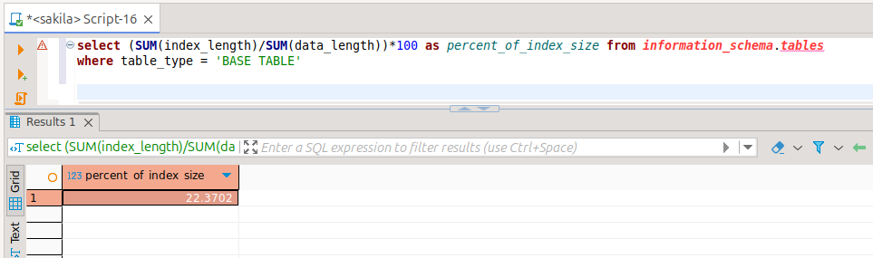
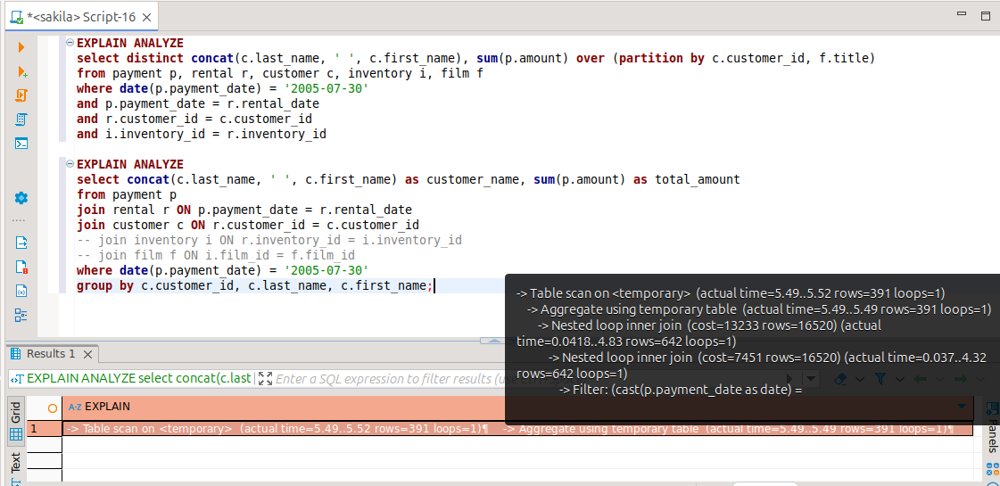
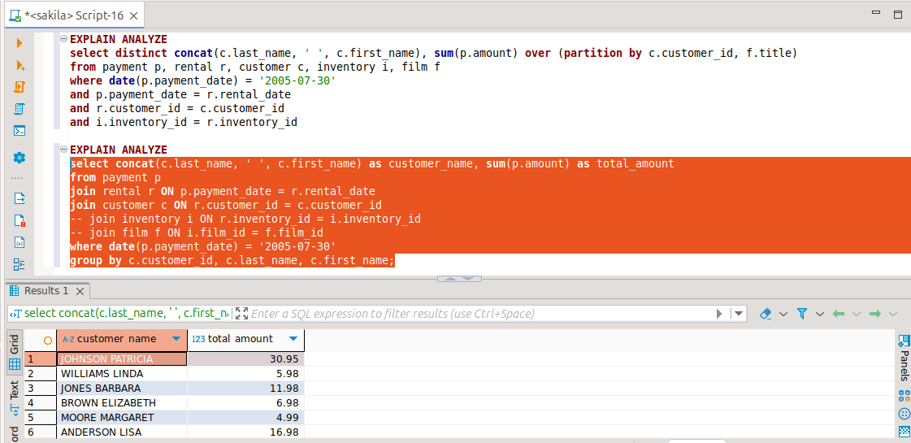

# Домашнее задание к занятию "Индексы" - Байков Михаил

### Задание 1

Напишите запрос к учебной базе данных, который вернёт процентное отношение общего размера всех индексов к общему размеру всех таблиц.

### Решение 1
```sql
select (SUM(index_length)/SUM(data_length))*100 as percent_of_index_size from information_schema.tables
where table_type = 'BASE TABLE'
```



### Задание 2

Выполните explain analyze следующего запроса:
```sql
select distinct concat(c.last_name, ' ', c.first_name), sum(p.amount) over (partition by c.customer_id, f.title)
from payment p, rental r, customer c, inventory i, film f
where date(p.payment_date) = '2005-07-30' and p.payment_date = r.rental_date and r.customer_id = c.customer_id and i.inventory_id = r.inventory_id
```
- перечислите узкие места;
- оптимизируйте запрос: внесите корректировки по использованию операторов, при необходимости добавьте индексы.

### Решение 2
Не используются JOIN. Используется partition. Запрашиваются не нужные для результата данные. 
В итоге запрос выполняется 4 секунды.

Запрос можно написать так, попутно отказавшись от ненужных соединений:
```sql
select concat(c.last_name, ' ', c.first_name) as customer_name, sum(p.amount) as total_amount
from payment p
join rental r on p.payment_date = r.rental_date
join customer c on r.customer_id = c.customer_id
-- join customer c on p.customer_id = c.customer_id
-- join inventory i on r.inventory_id = i.inventory_id
-- join film f on i.film_id = f.film_id
where date(p.payment_date) = '2005-07-30'
group by c.customer_id, c.last_name, c.first_name;
```
В итоге запрос выполняется 6 миллисекунд.


